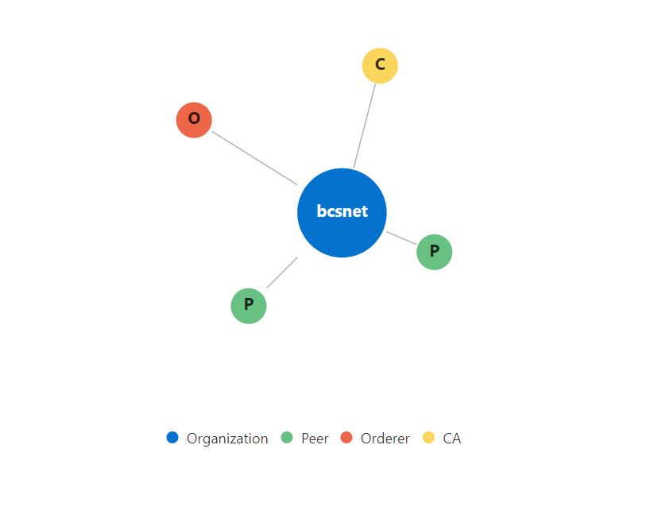
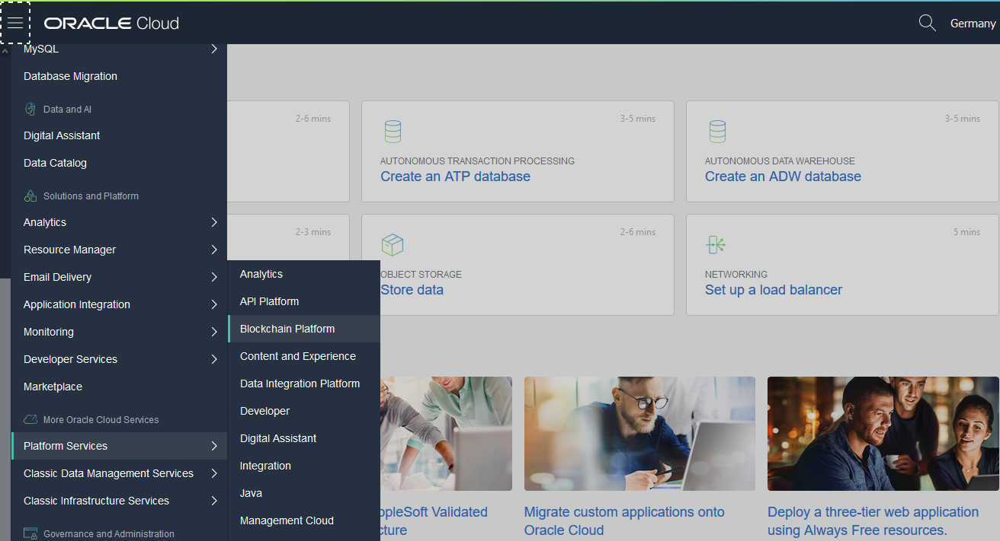
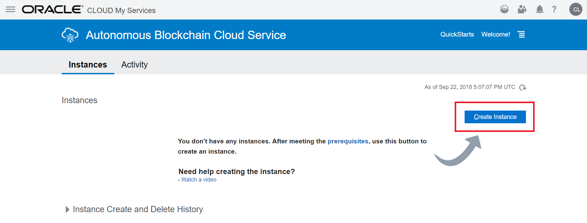
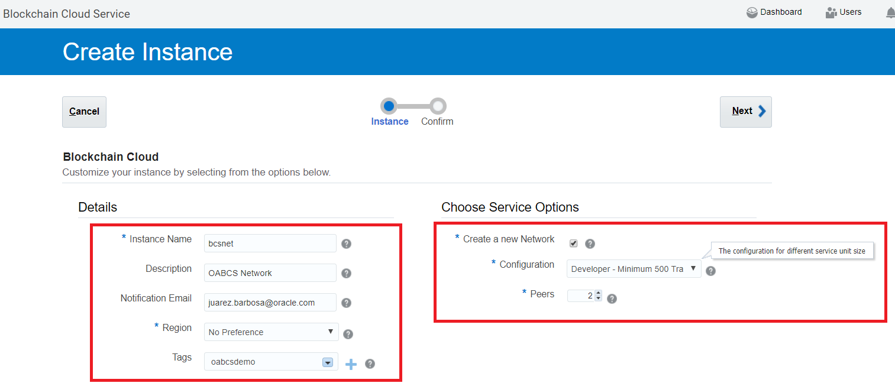
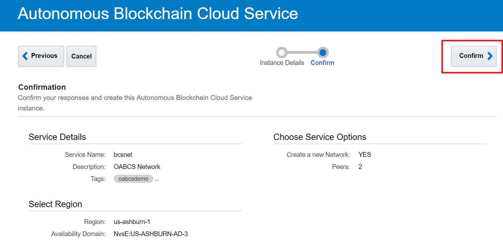
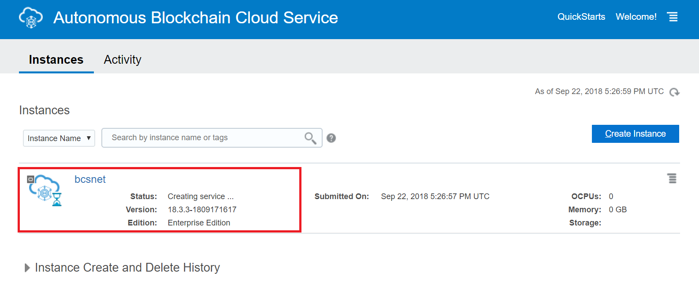

# Create the Blockchain Network

Note that this part comes from a blog of Juarez Junior on internet. No need to do mine cause Juarez did a very good job :o)..I have just refreshed some parts...except that on screenshots you see "Autonomous Blockchain" now replaced by "Oracle Blockchain Platform".

## Provision the network founder instance

In Hyperledger, we have two core roles — the Network Founder and the  Participant Organizations. The network founder is the owner of a given  Blockchain network, also called the consortium network. The Founder role controls the network topology composition and the participant  organizations that will be able join a given consortium.

The steps below how you can provision the Blockchain Network Founder  instance. As we move through the steps some other concepts and details  will be explained and clarified.

So without further ado, let’s create our Oracle Blockchain Service, Network Founder instance.

Sign in to Oracle Cloud;

Open the subscription notification email sent by Oracle. Typically, this  email includes the subject line Welcome to Oracle Cloud;

Right-click the URL displayed in the My Services URL field and select Open in new tab;

Copy the user name displayed in the Username field and then paste it into the User Name field;

Copy the password displayed in the Temporary Password field and then paste it into the Password field;

Click Sign In.

From the main screen, select the *hamburger* user  interface component at the top left corner of your screen (the one  inside the square below). You will see the right side actions bar.

Click on Platform Services and Select BlockChainPlatform

You will see the *Oracle Blockchain Cloud Service* page with the instances list (it’s still empty, no Blockchain instances yet).

Now click the Create Instance button as show above and the instance  creation page will appear as below where you need to input the Network  Founder instance details.

Go ahead to provide the required instance details, example is below:

Instance Name: bcsnet

Notification Email: <your_email_address>

Select the Create a new Network checkbox, as this instance is the one allocated to a Network Founder.

In the Configuration combo box, select the Developer option in the options list.

Keep the number of peers as 2 as it might suffice for your development  purposes. Click the Next button. On the next screen, then click the  Confirm button.

The instance provisioning will start and it will take just a few  minutes. The status will be shown as below during the instance  provisioning time.

That’s it. After the completion, we’ll have just one instance so it’s still  not possible to configure a network as we need at least two instances in order to configure a Blockchain consortium in Hyperledger.

After that we’ll provide the steps to provision the first Participant Organization so that we can start our network configuration after that.

Next [Participant Organization](02-participant.md)