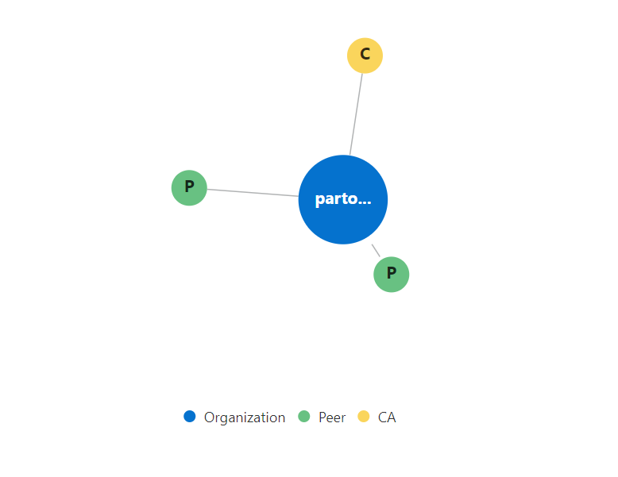
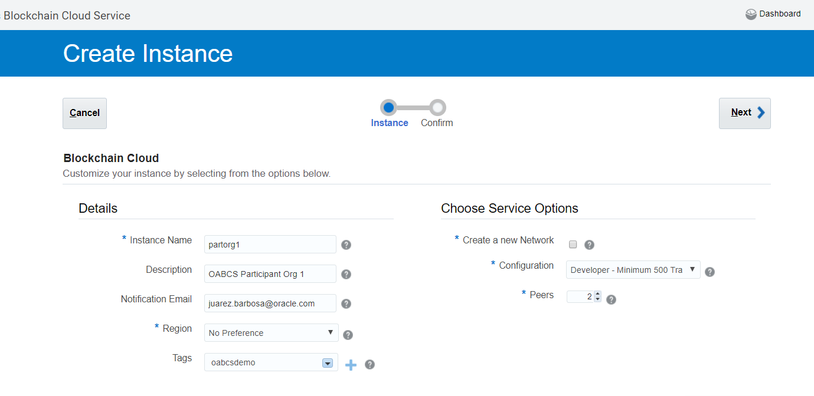
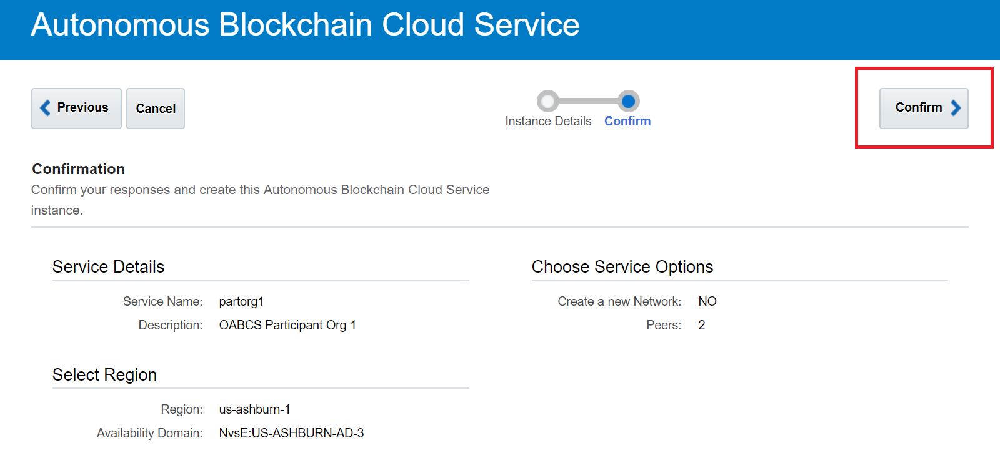
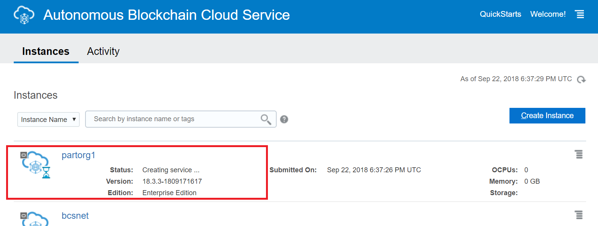

# How to Provision a Participant Organization Instance

As explained in the previous blog post, Hyperledger uses two core network  roles — the Network Founder and the Participant Organizations. This blog post shows how to provision a Participant Organization instance.

As we move through the steps some other concepts and details will be explained and clarified.

So without further ado, let’s create our Oracle Blockchain Service, Participant Organization instance.

Now click the Create Instance button as previous and the instance  creation page will appear as below where you need to input the  Participant Organization instance details.

Go ahead to provide the required instance details, example is below:

Instance Name: partorg1

Notification Email: <your_email_address>

Deselect the Create a new Network checkbox, as this instance is the one  allocated to a Participant Organization of an existing network, so we do not need to create a new network (consortium). It must be unchecked  then.

In the Configuration combo box, select the Developer option in the options list.

Keep the number of peers as 2 as it might suffice for your development  purposes. Click the Next button. On the next screen, then click the  Confirm button.

The instance provisioning will start and it will take just a few  minutes. The status will be shown as below during the instance  provisioning time.

That’s it. After the completion, we’ll have a couple of instances — one for  the Network Founder and one for the first Participant Organization, so  we can proceed to create a blockchain network (consortium).

Then we’ll provide the steps to create our first Fabric network and the required configurations.

Note that you can, if you want create, a new Participant Organization called partorg2 as you did with partorg1.

Next [configuration.md](03-configuration.md)

