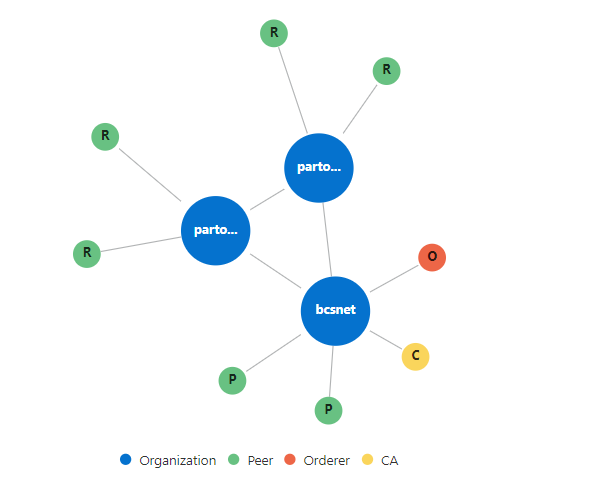
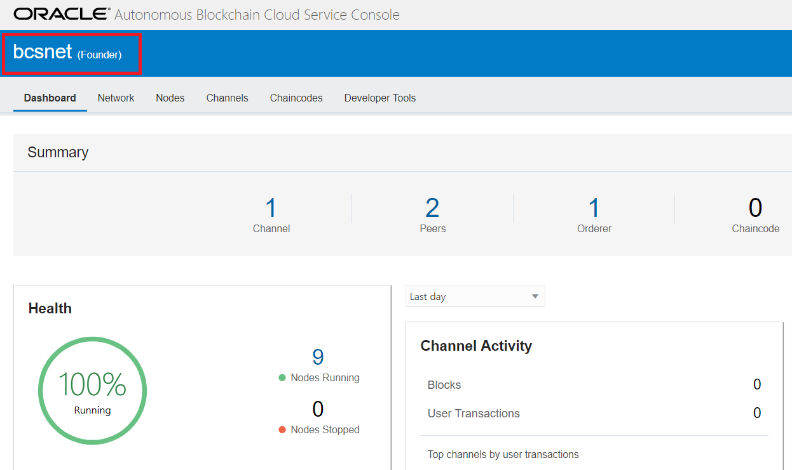
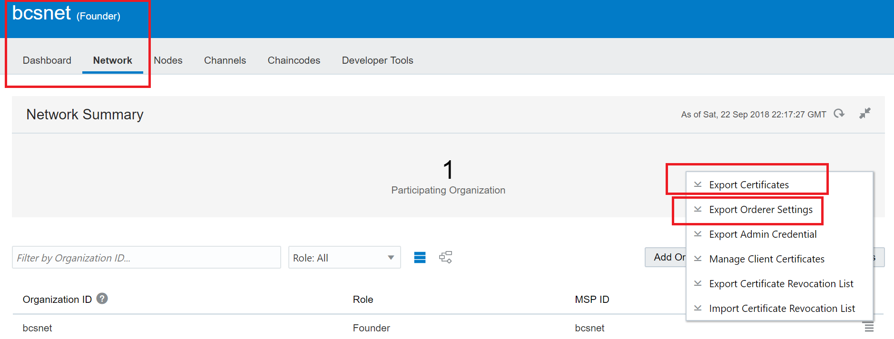
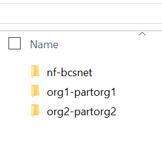
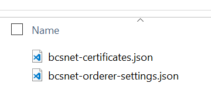
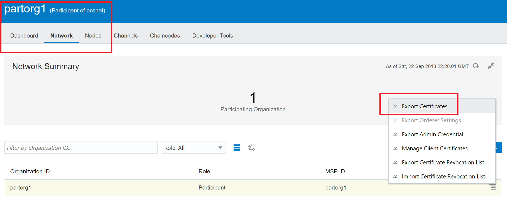
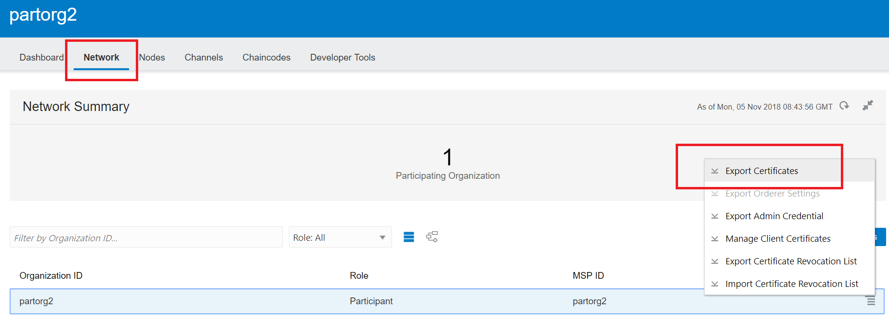
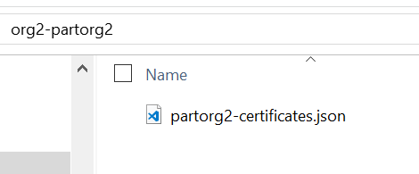

# Fabric Network Configurations

Now we have to perform the Fabric network configurations, including the  ones required for peers, channels, security and other components. This  workshop provides the steps required to perform such configurations.

let’s configure our Blockchain network as per the Hyperledger Fabric requirements and conventions.

The previous blog posts explained how to access your OBCS instances, please perform the same steps again.

Let’s start with the network founder artifacts. You need to access the  network founder console in order to export the required configuration  artifacts.

Select the hamburguer interface option as below and the click Blockchain Console option as shown below:

The console for the network founder will be shown then.

# Export the Network Founder configurations

On the main screen, select the Network tab. Then select the hamburguer  option for the network founder instance (bcsnet) as shown below, then  select the Export Certificates option, save the file in a separate  folder as you will need it shortly.

Perform the same step and then select the Export Ordering Settings option and save the file again.

As an example, we have separate directories for the Network Founder  configuration artifacts as well as for each Participant org as shown  below:

You can access the nf-bcsnet directory (the one that belongs to our  Network Founder) and you will see the configuration files that we  exported and saved in the previous steps:

# The Participant Organization and their consoles

Now let’s work with the participant organizations artifacts. You need to  access the participant organization consoles in order to export the  required configuration artifacts.

The participant organizations need to join a Blockchain network that belongs to a given Network Founder.

In summary, in the steps below we will perform the steps required to join a network:

*1. Go to your console’s Network tab and use the Export Certificates option to export your organization’s certificates to a JSON file.*

*2. Send the JSON file to the founding organization. The founding organization imports this file to add you to the network.*

*3. Go to your console’s Network tab and use the Import Orderer Settings  option to import the founding organization’s orderer settings.*

Select the hamburguer interface option as below and the click Autonomous  Blockchain Console option as shown below for each participant  organization.

The console screen for each organization will be shown:

In case you have more Participant Organization, perform the same step again.

# Export the Participant Organizations configurations

On the main screen, select the Network tab. Then select the hamburguer  option for the respective participant organization (partorg1 or  partorg2) instance as shown below and select the Export Certificates  option.

Save the certificate file in the respective folder as required.

Perform the same steps for a second Organization.

# Import the Orderer Settings into each Participant Organization

On the main screen, select the Network tab. Then select the hamburguer  option for the respective participant organization (partorg1 or  partorg2) instance as shown below and click the Import Orderer Settings  button, select the Import option.

Next  [04-devcs-patch.md](04-devcs-patch.md)