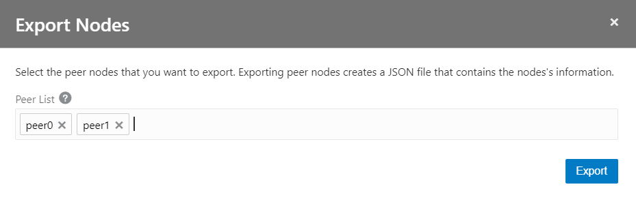
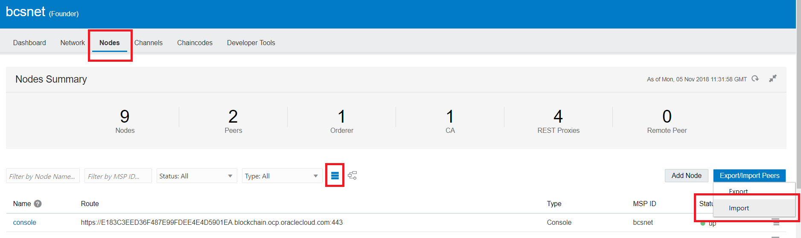

# Fabric Network Configurations

Now we have to perform the Fabric network configurations, including the  ones required for peers, channels, security and other components. This  workshop provides the steps required to perform such configurations.

let’s configure our Blockchain network as per the Hyperledger Fabric requirements and conventions.

The previous blog posts explained how to access your OBCS instances, please perform the same steps again.

Let’s start with the network founder artifacts. You need to access the  network founder console in order to export the required configuration  artifacts.

Select the hamburguer interface option as below and the click Blockchain Console option as shown below:

The console for the network founder will be shown then.

# Export the Network Founder configurations

On the main screen, select the Network tab. Then select the hamburguer  option for the network founder instance (bcsnet) as shown below, then  select the Export Certificates option, save the file in a separate  folder as you will need it shortly.

Perform the same step and then select the Export Ordering Settings option and save the file again.

As an example, we have separate directories for the Network Founder  configuration artifacts as well as for each Participant org as shown  below:

You can access the nf-bcsnet directory (the one that belongs to our  Network Founder) and you will see the configuration files that we  exported and saved in the previous steps:

# The Participant Organization and their consoles

Now let’s work with the participant organizations artifacts. You need to  access the participant organization consoles in order to export the  required configuration artifacts.

The participant organizations need to join a Blockchain network that belongs to a given Network Founder.

In summary, in the steps below we will perform the steps required to join a network:

*1. Go to your console’s Network tab and use the Export Certificates option to export your organization’s certificates to a JSON file.*

*2. Send the JSON file to the founding organization. The founding organization imports this file to add you to the network.*

*3. Go to your console’s Network tab and use the Import Orderer Settings  option to import the founding organization’s orderer settings.*

Select the hamburguer interface option as below and the click Autonomous  Blockchain Console option as shown below for each participant  organization.

The console screen for each organization will be shown:

In case you have more Participant Organization, perform the same step again.

# Export the Participant Organizations configurations

On the main screen, select the Network tab. Then select the hamburguer  option for the respective participant organization (partorg1 or  partorg2) instance as shown below and select the Export Certificates  option.

Save the certificate file in the respective folder as required.

Perform the same steps for a second Organization.

# Import the Orderer Settings into each Participant Organization

On the main screen, select the Network tab. Then select the hamburguer  option for the respective participant organization (partorg1 or  partorg2) instance as shown below and click the Import Orderer Settings  button, select the Import option.

The window below will be shown. Select the JSON file for the ordered  settings as exported in the previous steps  (bcsnet-orderer-settings.json).

You can confirm the orderer information as shown below as a double check,  then click the Submit button. A success message will be shown.

Perform the same steps above for the remaining Participant Organization, that is partorg2 in this guide for example.

# Import each Participant Organization certificates into the Network Founder

On the main screen of the Network Founder console, select the Network tab. Then click the Add Organizations button as shown below:

The screen below will be shown. Select the organization certificate file for each participant organization in your network. In our example we  have a couple of files for both partorg1 first, then partorg2 second.

The window below will be shown. Select the JSON certificates file for the  given participant organization as exported in the previous steps (*partorg1-certificates.json* and *partorg2-certificates*).

You can confirm the participant organization’s information as shown above  as a double check, then click the Add button. A success message will be  shown.

After all the import procedures, you can check the network topology view.  Select the Network Tab, click the Topology View icon. You will see the  participant organizations now as part of this Blockchain network.

However, the node peers of each organization are now shown yet as you can see  above. That is because those are what we call remote nodes.

In order to allow the Network Founder to see the remote nodes that belong  to our Participant Organizations, we need to export their configurations and import them in to the Network Founder configuration. The steps  below show how to achieve that.

Go to your first Participant Organization’s console, select the Nodes tab, click the select the List View. Now click the Export / Import Peers  button.

Select the peers to export, then click the Export button. Save the file  in the same directory where the certificates for the first Participant  Organization are located.

The resulting JSON file with the peers information (*partorg1-exported-nodes.json*) will be saved and available as below:

Perform the same steps above for the second Participant Organization (partorg2).

Now the last step is to import the remote peer node files in to the Network Founder configuration.

Go to the Network Founder console, select the Nodes tab again, then select the List View and click the Export / Import Peers button. Select the  Import option.

Select the corresponding remote peer nodes files as shown below and click the Import button.

Now you can check the network topology view again. Select the Network Tab, click the Topology View icon.

You will see the remote nodes of those Participant Organizations now as part of this Blockchain network.

# Channels Configurations

The channels enforce the logical separation of a Blockchain network by  isolating a defined group of participants, related peer nodes, ledgers,  chaincode and the related transactions.

It is the first level of permissioned security that can be enforced from a Blockchain point of view.

As shown in the Instance Creation guide, when you create the Blockchain  network a default channel is provided out-of-the-box by the template.

In order to see it, access the Network Founder console, select the Nodes tab, then click the Topology View icon as shown below.

You will see a graphical representation as shown below:

We can use the channel and add more Participant Organizations to it along  the related peer nodes that belong to each Participant.

However, you can also create new channels to implement additional isolation  among different Participant Organizations, depending on how you want to  logically divide them.

# Create a new Channel

The steps below show to create a new channel:

Let’s use the first Participant Organization’s console (partorg1) and create a channel.

Select the channels tab and click the Create a New Channel button as shown below:

Provide the new channel information as shown below, including the channel name  and select the peer nodes that are supposed to join the channel.

In case you want you can add as many organization as you need, just click  the Add Organization button and provide its configuration file by  clicking the icon with an arrow that points upwards.

Note that you are not able to delete a channel after it is created, so create your channels wisely.

So on the next screens, you will see the channel you’ve just created as shown below:

# Configure the Anchor Node

Now let’s configure the anchor node. In Hyperledger Fabric, the anchor node will be a peer node on a channel that all other peers nodes can  discover and communicate with.

It somehow acts as the front controller and centralizes all the state  replication and communication with other peer nodes in a given channel  and the network at that point.

Each Member on a channel has an anchor peer (or multiple anchor peers to  prevent single point of failure), allowing for peers belonging to  different Members to discover all existing peers on a channel.

Click the channel name, click the peer link on the left and then select  the checkbox for your desired peer node and click the Set Anchor Peers  button as show below:

In the future in case you need to add more Participant Organizations our peers to a given channel, just click the Hamburguer component and  select the desired option.

Go to the Network Founder console and do the same with the default channel.

# Add more Peers to a new Channel

At last, make the Network Founder peers join this channel as well. Click  the Channels tab, you will that your partorg1ch1 has no peers (0 — zero) yet as shown below:

Click the Hamburguer component, select the Join Peers to Channel option as below:

Select the peers you want to add and click the Join button.

A success message will be shown and the number of peers for this channel will be updated on the Network Founder configuration.

# Check the new Channel topology in Topology View

Select the Nodes tab, click Topology View icon and you will see the new channel as configured in the steps above.

You can create as many channels as you need as well as add as many peer  nodes as you might need, it’s totally flexible so that it can address  your business and network topology needs.

That’s it. After the completion of all the steps above, our Blockchain network consortium will be configured and ready to our next step — the  chaincode (smart contract) deployment.

Next  [04-devcs-patch.md](04-devcs-patch.md)