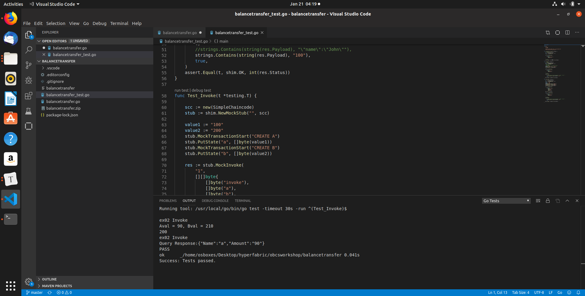
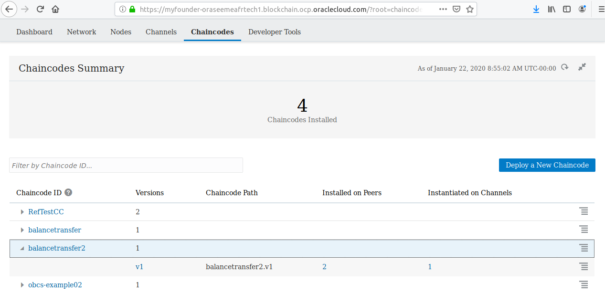

# How to Deploy the Chain Code (Smart Contract)

Before beginning you have to check that your Visual Studio Code can be used to develop and test with go language. We decide to use Golang because with Hyperledger Fabric most of the chain code is written in Golang.

Get the code by cloning the github project cpruvost/blockchainworkshop

Open VSCode and then in the menu File / Open Folder --> Choose the directory 'balancetransfer'

In this directory you have the chain code "balancetransfer.go". It is a standard exemple used with hyperledger.  

In this chain code you manage the value of the bank account of A and B and you are able to transfer money between A and B.

In this one we add one function that allow to see the historic state transitions. Take time to look at the code, it is important that you understand the standard structure of a chain code.

After that Look at the unit tests in "balancetransfer_test.go".  You can use  the mock implementation of the Hyperledger Fabric shim stub to compile,  run, and execute simple chaincode tests without connecting to a running  network. Take time to understand the code and do a run test on different functions.

Let’s start with the Network Founder role. You will need to access the network founder console in order to deploy the chaincode.

Besides, you also need to get the example chaincode source code (golang) and  package it in a ZIP file. Just copy the source code file (balancetransfer.go)  and then create a zip file (balancetransfer.zip) that contains the source  code file .

Select the Chaincode tab and the click the Deploy a New Chaincode button as shown below:

Select the Quick Deployment option as it suffices for the vast majority  of chaincode deployment needs. The Advanced Deployment option gives you  more flexibility regarding the deployment arguments but the Quick  Deployment one is the usual path.

Before the next part, note that we will use a channel named "myfounderch1", the name of the chaincode deployed will be "balancetransfer2" and the proxy node will be the number 1. You can use the channel you created before or another, you can use the name that you want and the proxy node that you want, but in this case you just have to remember that for the next part.

So Quick Deployment..

Confirm that you want to deploy your chaincode as it cannot be removed  after deployed, similar to channels as per the Hyperledger Fabric  contract.

The deployment process starts as shown below. The deployment process  takes a while as several steps need to be performed in background,  including compilation, container provisioning and others. You will see a progress bar with the *Instantiating chaincode* message first.

Then it will be updated and show the *Enabling in REST proxy* message.

At last, a confirmation message will be shown:

You can then check the chaincode tab again and you will see the chaincode as deployed and listed as shown below.

At last, remember that you can also deploy chaincode by using the consoles of other Participant Organizations as required.

That’s it. After of all the steps above are completed properly, your chaincode will deployed and ready to our next step — invoke the chaincode methods via the REST API.

Next [restapi.md](05-restapi.md)

