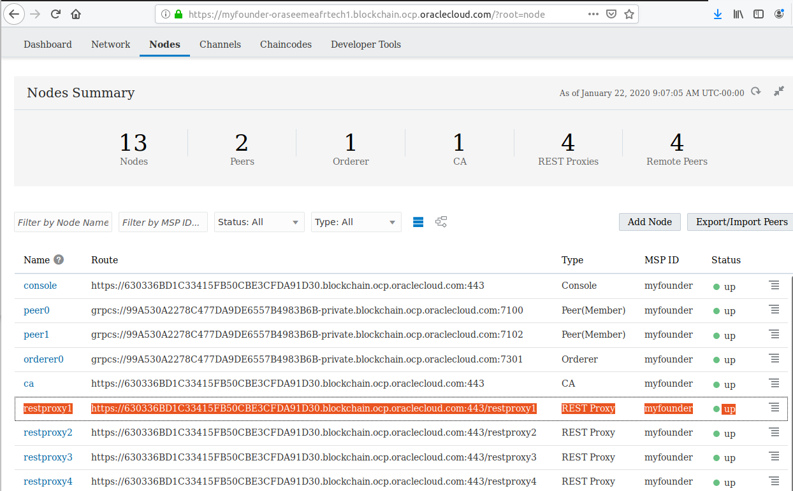
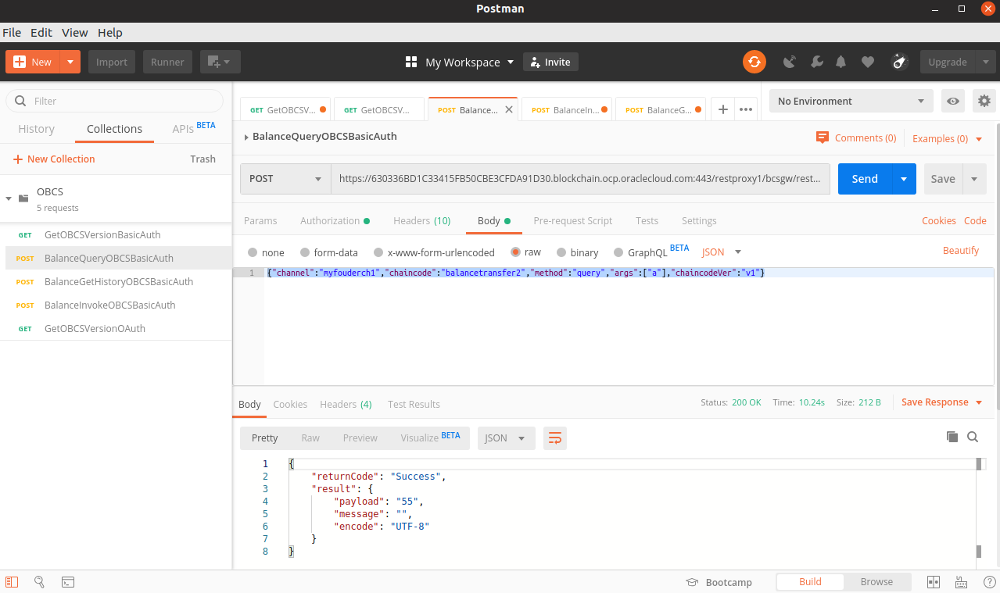
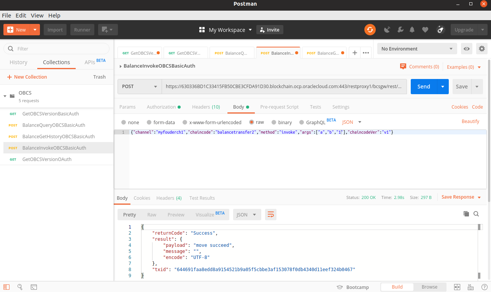
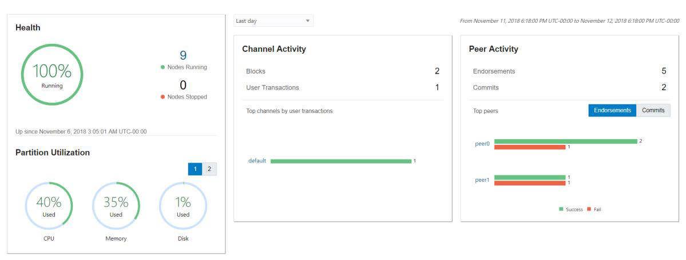
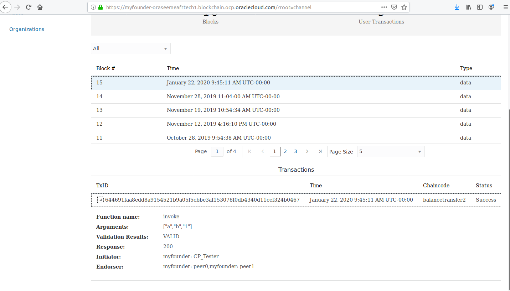
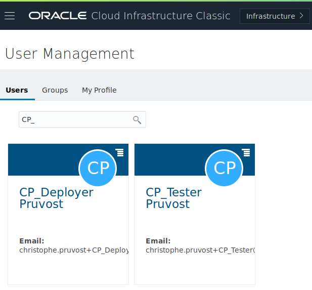
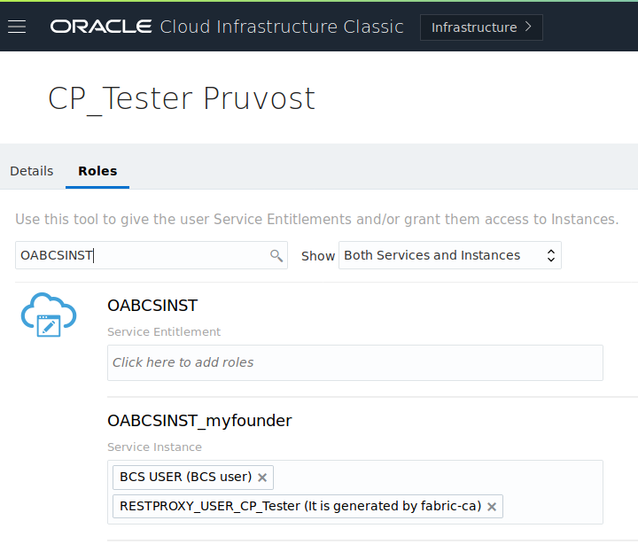
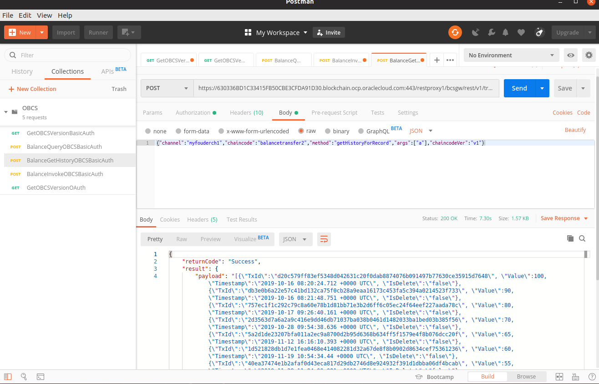

# Invoke Chain Code via REST API

The Oracle Blockchain Cloud Service has a REST API that can be used to  interact with your chaincode. Here you can get the list of OBCS API [REST Endpoints](https://docs.oracle.com/en/cloud/paas/blockchain-cloud/rest-api/rest-endpoints.html) so you can understand what can be performed with it. Not only calls to  smart contracts but also many operational and management tasks can now  be performed by using the REST APIs.

The instructions below provide examples about security and transactions.

Below we first have the steps considering how you can authenticate a REST  client against the service as well as how to check the OBC version,  invoke transactions and read data from the Blockchain.

In order to perform the REST call, you have many choices as usual. You can use several different programming languages and the related REST client libraries, for example a Java REST API client like the one available in the [Jersey ](https://jersey.github.io/)libraries (JAX-RS). You can also use command line (CLI) tools such as [curl ](https://curl.haxx.se/)for example.

There are also several browser plugins that you can use like Postman. In the examples

below we’ll use [Postman ](https://www.getpostman.com/)as it simplifies the tasks as well as it can abstract you from the  differences that might exist in different operating systems like the  need for character scape tweaks, different encoding standards and  others.

In order to perform the calls, you need to check and provide the URL for the OBCS REST Proxy You want to use.

**Understand the format of resource URLs**

In order to use the REST APIs, you need to determine the URL for your  instance. The structure of the REST URL requests is described in [Send Requests](https://docs.oracle.com/en/cloud/paas/blockchain-cloud/rest-api/SendRequests.html). The basic URL template is shown below:

```
https://<rest_server_url:port/restproxy#>/<resource-path
```

In order to get that for your Blockchain instance, go to the Nodes tab on  the OBCS console, select the List View icon and then click copy the link from the related REST Proxy node.

Note that you have to repace the rest_server_url and port to target your own environment (OBCS instance with the related REST proxy). You can get  the information about your proxy (restproxy1 in the URL below) from the  Nodes tab on the OBCS instance console.



Below we have an example URL:

https://630336BD1C33415FB50CBE3CFDA91D30.blockchain.ocp.oraclecloud.com:443/restproxy1

**How to use the Postman tool to perform REST API calls against OBCS**

We will use Postman. It’s a REST tool you can install as a [Google Chrome plug-in ](https://chrome.google.com/webstore/detail/postman/fhbjgbiflinjbdggehcddcbncdddomop?hl=en)for example or as a [standalone tool](https://www.getpostman.com/downloads/) (= the better choice). It’s up to you to decide which one is the best option for you. Install and start Postman.

You can use use [curl](https://curl.haxx.se/), a command-line (CLI) tool.

The first call we’ll perform will be just a call to check the Oracle  Blockchain Cloud Service version. Below we have what this call looks  like in plain curl syntax. You need to provide your <user_name> as well as your <password> in the call below:

```
curl -u <YOUR_USER_ID>:<YOUR_PASSWORD> -X GET
https://630336BD1C33415FB50CBE3CFDA91D30.blockchain.ocp.oraclecloud.com:443/restproxy1/bcsgw/rest/version
```

Provided that everything is correct, the version will be returned as a  JSON response as shown below. That will allow you to validate your  target REST proxy URL as well as your authentication details.

```
{"version":"v1.0"}
```

**Security and authentication methods**

In relation to security, this guide just provides an example on how to use standard HTTP BASIC authentication, however other authentication  methods are also supported such as [OAuth 2.0](https://oauth.net/2/) and [Oracle Identity Cloud Service](https://cloud.oracle.com/en_US/identity) federation. So at the end you just use your Oracle Cloud account (email/password).

**Blockchain transactions — queries and invocations**

So now we can perform our first Blockchain transaction invocation.

Let’s execute a call to add a Car as per the example chaincode we provided in the previous blog post.

Below we have what this call looks like in plain curl syntax and the  following screenshots will show how to use Postman for the the same  related call.

```
curl -u <YOUR_USER_ID>:<YOUR_PASSWORD> -H "Content-type:application/json" -X POST https://630336BD1C33415FB50CBE3CFDA91D30.blockchain.ocp.oraclecloud.com:443/restproxy1/bcsgw/rest/v1/transaction/query -d '{"channel":"myfouderch1","chaincode":"balancetransfer2","method":"query","args":["a"],"chaincodeVer":"v1"}'
```

```
{"returnCode":"Success","result":{"payload":"55","message":"","encode":"UTF-8"}}
```

On Postman, configure the HTTP method as POST and provide the target URL as shown below.



Click the Authorization tab and select HTTP BASIC as the authentication  method, then provide your username and password and click the Update  Request button.

Then select the Headers tab, add an additional HTTP request header Content-Type and the value of it as application/json.

Now, select the Body tab, select the raw radio button option and provide the body payload as *JSON* from the original curl call provided above.

Press the button "Send" and you wil get the value for the account "a".

Now instead of query we will invoke the function in order to transfer the value 1 from the account "a" to the account "b"



Just not that the url is now : https://630336BD1C33415FB50CBE3CFDA91D30.blockchain.ocp.oraclecloud.com:443/restproxy1/bcsgw/rest/v1/transaction/invocation

Use the good parameters as shown and press the button "Send".

Besides, the response body as JSON will provide a returnCode with the value as *Success* as well as the txid attribute will provide the effective transaction ID on the Blockchain side !

After that query the value of "a" to check that it decreased of 1 so 54 and not 55 in our case. Sure value of "b" increased of 1. Do it again and check all the values of "a" and "b" if you want. 

**Blockchain transactions — dashboard**

As you may know, you can use the Dashboard in order to inspect the related transaction metrics and additional information as usual.



Now you can go on your network for ex "myfounderch1" for me. Then you will see your transaction and the TxId associated to it.



If you click to see the details you will have the initiator of the transaction. On the screen for me it is CP_Tester because I do not use as you my Oracle Cloud Account but a user that I created before. You will not do that on that workshop but I want to show you that the users of your application working with Oracle Blockchain are under surveillance too....:o).

I can go on the User Management in the web console (Do not that yourself...just read)



I click on CP_Tester in order to see the security roles on Blockchain



Note that all what you see before (blochain network, users and the roles associated) can be created using "Infrastructure As Code" (REST API, or Oracle Cloud CLI).

At the end you can invoke the function getHistoryForRecord on the account  "a" and see that the Blockchain has stored all the values from the start. 



Next [javasdk.md](06-javasdk.md)

