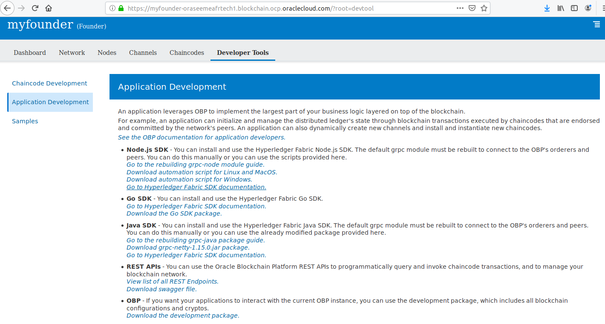
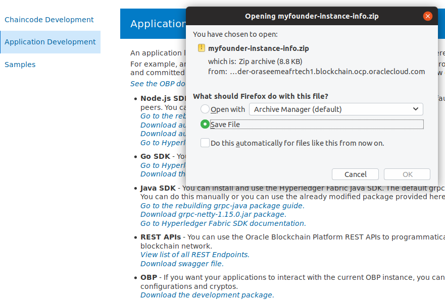
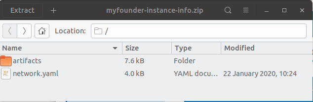
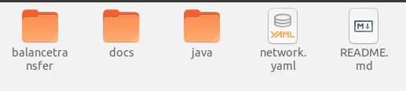
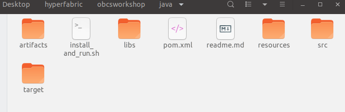

# Invoke Chain Code via Java SDK

Note that the sample code for Java SDK is not in the sample project balancetransfer but in the sample project carDealer so I used this one to create the code for balancetransfer.

It is not so simple as REST API because first you have to download the security files that allow you to invoke chaincode

Go in the web console and click on Developer Tools / Application Development



Click on OBP (Download the development package) and save the file on your laptop



The zip file contains directories and files mandatory for your Java SDK code.



Unzip the file in the project directory that you got from github like below for the file network.yaml and the directory artifacts 





Then in VSCode Open the directory Java of your project coming from github.

Take time to look at the code of balancetransfer.java, at the file network.yaml, and at the file ./install_and_run.sh run

Now in the console you can run the code with : ./install_and_run.sh run

The result looks like :

```
orgname : myfounder
client : PeerAdmin_myfounder_myfounder
Reconstructing myfouderch1 channel
Finished reconstructing channel myfouderch1.
channel : myfouderch1
select peer: myfounderpeer1
ChaincodeID(balancetransfer2:github.com/go:v1)
Query payload of b from peer myfounderpeer1 returned 54
54
```

If you have errors then find in the code where is the problem :o)

Have a nice day...your Blockchain projects can start now :o) 

