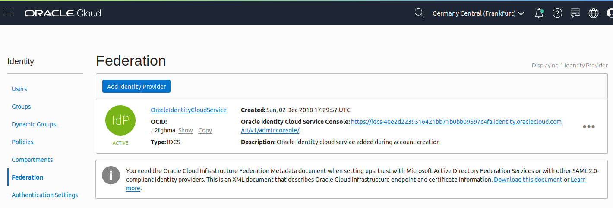
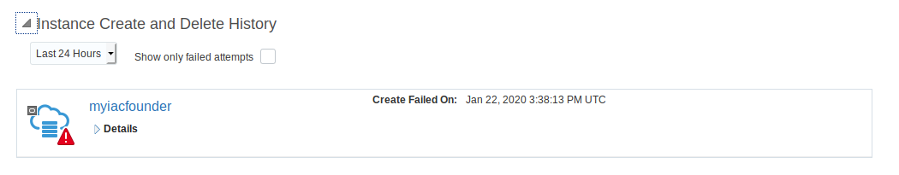

# Use Infra As Code to create Oracle Blockchain Network

The first step is to install the Paas Service Manager CLI (psm CLI)

First open your cloud console in order to find the name of your identity cloud service (ex for me : idcs-40e2d2239516421bb71b0bb09597c4fa)

In the menu click on Identity / Federation and note the name of your identity Cloud service



Then you need to download the psmcli.zip with curl. Replace the idcs name by yours and be carefull if you are not in europe because in this case you have to update the psm url too.

The Identify your REST API server name:

- If you log in to your Oracle cloud account with a US data center, use `psm.us.oraclecloud.com`
- If you log in to your Oracle cloud account with the aucom region, use `psm.aucom.oraclecloud.com`
- Otherwise, use `psm.europe.oraclecloud.com`

```
curl -X GET -u "myuser321:password -H X-ID-TENANT-NAME:"idcs-40e2d2239516421bb71b0bb09597c4fa" "https://psm.europe.oraclecloud.com/paas/api/v1.1/cli/idcs-40e2d2239516421bb71b0bb09597c4fa/client" -o psmcli.zip
```

Then install psmcli.

```
On Linux : sudo —H pip3 install -U psmcli.zip
On Windows and ubuntu : pip3 install -U psmcli.zip
```

Update your PATH variable to be able to call psm everywhere

```
sboxes@osboxes:~/Desktop$ psm --version
Oracle PaaS CLI client 
Version 1.1.28
```

Now you have to do a psm setup before using it. In this step you need the idcs name.

```
osboxes@osboxes:~/Desktop$ psm setup
Username: christophe.pruvost@oracle.com
Password: 
Retype Password: 
Identity domain: idcs-40e2d2239516421bb71b0bb09597c4fa
Region [us]: emea
Output format [short]: 
Use OAuth?[n]
-------------------------------------------
'psm setup' was successful. Available services are:

....
OABCSINST : Oracle Blockchain Platform
....
```

Do psm OABCSINST in order to explore all the available commands

```
osboxes@osboxes:~/Desktop$ psm OABCSINST help

DESCRIPTION
  Oracle Blockchain Platform

SYNOPSIS
  psm OABCSINST <command> [parameters]

AVAILABLE COMMANDS
  o services
       List all Oracle Blockchain Platform instances
  o service
       List Oracle Blockchain Platform instance
  o create-service
       The create service operation
  o delete-service
       Delete Service
  o check-health
       Checks health of the service resources
  o operation-status
       View status of Oracle Blockchain Platform instance operation
  o activities
       View activities for Oracle Blockchain Platform instance
  o help
       Show help
```

Now we will create a new founder called "myiacfounder"

First we have to create a json file (create-service-payload.json) containing parameters. See below an example

```
{
"serviceName": "myiacfounder",
"appSize":"Developer",
"serviceLevel": "PAAS",
"region":"eu-frankfurt-1",
"organizationType": "true",
"numberOfPeersDev": "2",
"managedSystemType": "oracle",
"enableNotification":"true",
"notificationEmail":"christophe.pruvost@oracle.com"
}
```

Now we use psm.

```
psm OABCSINST create-service -c ./create-service-payload.json 
 Message:    Submitted job to create service [myiacfounder] in domain [idcs-40e2d2239516421bb71b0bb09597c4fa].
 Job ID:     173500923
```

We can check the status of the job

```
psm OABCSINST operation-status -j 173500923
 Service:           myiacfounder
 Operation Type:    CREATE_SERVICE
 Status:            RUNNING
 Start Time:        2020-01-22T15:26:24.375+0000
 End Time:          N/A
```

And using jq we get only the status

```
psm OABCSINST operation-status -j 173500923 -of json | jq ."status"
FAILED
```

Ok it failed ...so let's go in the console and look at the error message....



The problem is that I have reached my limits in terms of number of Blockchain : 

"Jan 22, 2020 3:28:53 PM UTCService has returned the following error(s) for service component  [onBoardService]: [Failed to do the customer instance provision  operation. {The provision permission of  idcs-40e2d2239516421bb71b0bb09597c4fa/christophe.pruvost@oracle.com to  create myiacfounder in eu-frankfurt-1 was not authorized!  [[ERR]:[P:APP]:[EAOP]: Failed to execute check_provision_perm operation  to target createService with environ  /u01/obcs/app/log/check_provision_perm-createService-20200122152740.env. return 110]}]."

No need to continue, the goal was that you understand how to do Infra As Code with Oracle Cloud...:o)