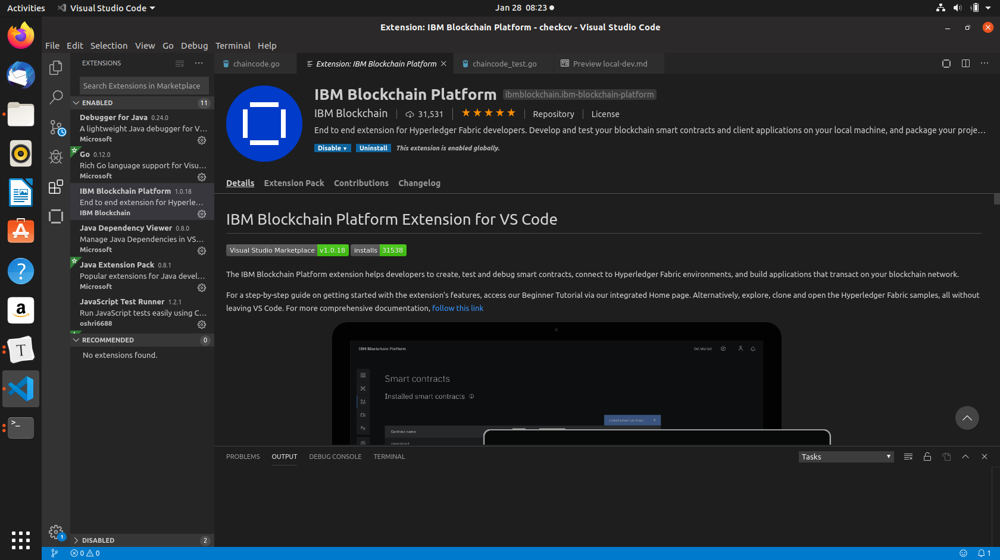
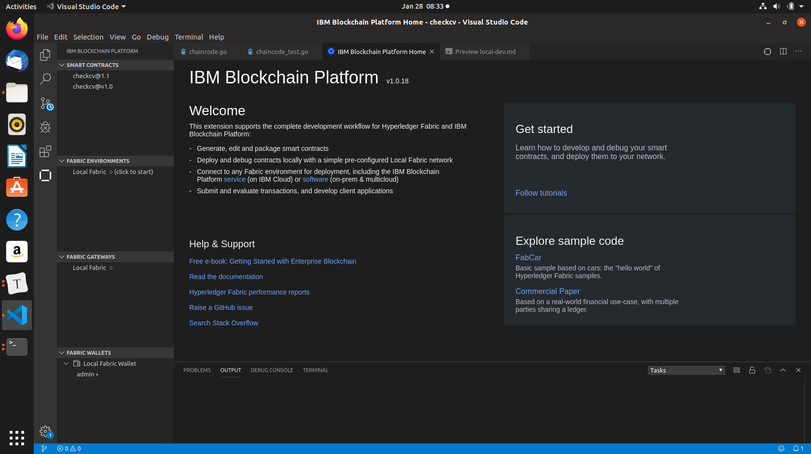
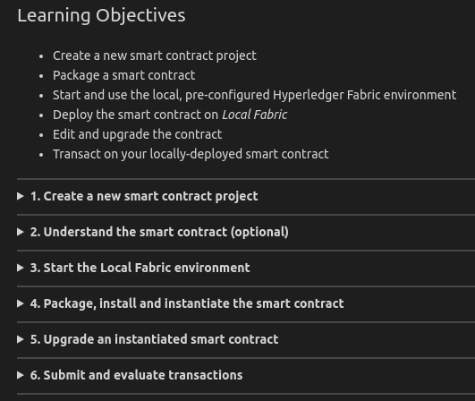
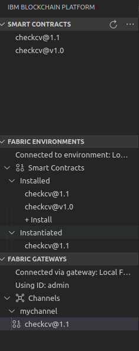
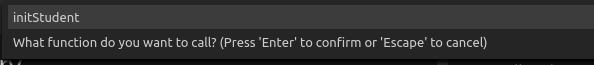
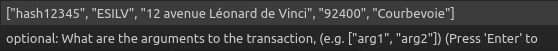
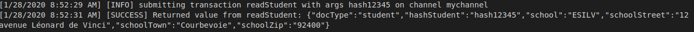

# Use IBM Blockchain Platform Extension

This extension from IBM in VSCode is really nice if you want to test your chaincode with Hyperledger locally.

The first step is to install IBM Blockchain Platform Extension. Take time to read what dependency you need to install before (ex : docker, ...).

Now open in vscode the directory go/src/checkcv of the github project.

Look at the chaincode in chaincode.go (note that the main function is in main.go).Look at the tests in chaincode_test.go and run it.

The symbol of this extension is : 

On the top rigth corner of VSCode click on the symbol of the extension 

Now click on follow tutorials and after click on Local smart contract development. You have to read all in order to understand how to use the extension.

Now you are ready to install, instantiate chainecode.go and after to run transaction in the local hyperledger via the gateway.

Click on the checkcv@1.1 in the FABRIC Gateways (the name of the version you choose when installing) and rigth click and choose submit transaction. Enter initStudent for the name of the function.

Look after in the code of the chaincode.go to copy a sample for the parameters. Press Enter to continue up to run. 

You have created the Student..now do that again but use the function readStudent and the parameter is the "hash12345"...Then see the student

It is really nice to be able to do a real local test like that with Hyperledger to check that all is good. You can deploy your chaincode now on Oracle Blockchain Platform if you want. Be carefull, the main function is in main.go so you have to put the 2 files chaincode.go and main.go in the zip before install it.

Next [Chaincode Generator](09-generator.md)