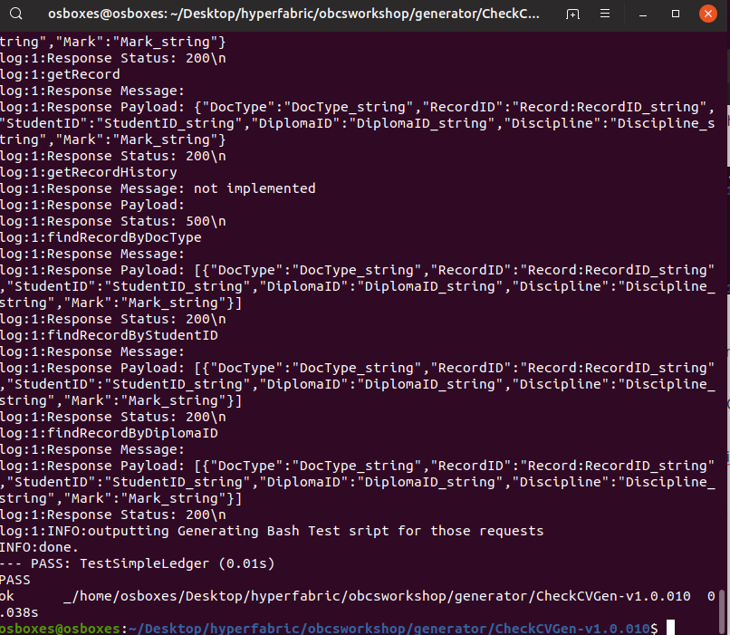

# Use the Chaincode Generator of Oracle Experts

First you have to understand important things :

- The source code of the Chaincode Generator is not public (so not in this github project) and you cannot have the source except may be by working with Oracle Consulting.
- The exe file of the Chaincode Generator is not public (so not in this github project). If someone from Oracle  give you this exe file for a reason that can be (Test, Demo, Poc, Workshop, ..) then you must keep it only for yourself. 

So now I can explain how to use it and you will see that you can save a lot of time with it.

In the github project, go in the Generator Directory and then copy the exe file (SmartContractGen) that someone from Oracle gave to you. 

In this directory you have to open the file (spec-file.txt) with VSCode

**First update the Project Information**

```
Ex For me 

@Project:CheckCVGen
@Author:christophe.pruvost@oracle.com
@Release:v1.0.010
```

**After Look at the Generators Parameters**

```
@AutoReleaseUpdate:true --> the number of version is incremented each time you run the generator
@GenerateInDirectories:true
@StringArraySeparator:+ --> if a field is a string array then this is the array separator
@RequireReason:true --> the generator ask you to write a reason each time you run it
@VerbosityLevel:1 --> the level of verbosity mainly use by lionel who has developed the generator
```

**After that update the Configuration Parameters**

```
@TestChannelName:myfounderch2 --> The name of the channel
@TestChaincodeName:CheckCVGenCC --> The name of your chaincode

@TestUser:christophe.pruvost@oracle.com --> The user that will call chaincode functions after deployment via REST API. If you have not created this kind of user then just use your user/password of Oracle Cloud.
@TestPassword:******

@DeployUser:christophe.pruvost@oracle.com -> The user that will deploy and instantiate chaincode. If you have not created this kind of user then just use your user/password of Oracle Cloud.
@DeployPassword:******

@TestURLQuery:https://630336BD1C33415FB50CBE3CFDA91D30.blockchain.ocp.oraclecloud.com:443/restproxy1/bcsgw/rest/v1/transaction/query --> The url of the proxy (ex : restproxy1) that you will be used to call queries on Chaincode functions

@TestURLInvoke:https://630336BD1C33415FB50CBE3CFDA91D30.blockchain.ocp.oraclecloud.com:443/restproxy1/bcsgw/rest/v1/transaction/invocation --> The url of the proxy (ex : restproxy1) that you will be used to call invoke on Chaincode functions

@DeployURLRoot:https://630336BD1C33415FB50CBE3CFDA91D30.blockchain.ocp.oraclecloud.com:443 --> -> The url used to deploy and instantiate chaincode.

@DeployPeersURLs: \
    grpcs://99A530A2278C477DA9DE6557B4983B6B-private.blockchain.ocp.oraclecloud.com:7100 ; \
   	grpcs://99A530A2278C477DA9DE6557B4983B6B-private.blockchain.ocp.oraclecloud.com:7102
   	--> The urls of the peers
```

**Then Declare your entities**  = assets = the information you want to store in the Blockchain.

A simple example : a diploma with only string fields. Remember that Hyperledger is a key/value store so you need a key for each diploma and the value is a json document.

```
Diploma: \
    string:DocType:IDX: \
    string:DiplomaID:KEY: \	
    string:StudentID:IDX: \
    string:Name:N/A: \
    string:Year:N/A: \
    string:Mention:N/A: \
    string:SchoolShort:IDX: \
    string:SchoolLong:N/A: \	 
    string:SchoolStreet:N/A: \
    string:SchoolZip:N/A: \
    string:SchoolTown:N/A: \
    string:FileName:N/A
```

Some details about the different fields :

DocType = "Diploma" because in the world state with Oracle Blockchain Cloud Service you know that you will be able to do a query like "give me all the results where DocType = "Diploma".

DiplomaID = The key needed to store and get the value (document).

StudentID = The pseudonym. RGPD told you that a student can send you a message like : "please destroy all the data about me in your system". You cannot destroy data because this is the Blockchain technology so you need to store information like student name, firstname, email, ... in another place (ex : a relational database). In a relational database you can do a delete of all information about a student.

And a lot of other fields. Just note that the fields with IDX are the fields that will be indexed. In this Blockchain Technology there is no automatic index so each time you create an asset/entity you have to update the index so you need to write this code. After that you will be able to do a findDiplomaBySchoolShort (this is an example). 

N/A means no KEY and no INDEX.

Instead of a string you have other choices in this generator :

strarray:DepartmentList:N/A --> a string array using the default  array separator described in Generator Parameters. Ex of a string array fields : DepartmentList = "Loire Atlantique+Orne+Calvados+.."

strarray,:DepartmentList:N/A --> you replace the default array separator by ",".  Ex of a string array fields : DepartmentList = "Loire Atlantique,Orne,Calvados,.."

int --> an integer

bool --> a boolean

Look at the file "spec-file-another-sample.txt" to better understand that.

**Now we are going to describe tests on our entities** 

```
$TEST:Comment: Diploma's tests
$TEST:Call:createDiploma:Diploma:dip00001:stud00001:Ingénieur Généraliste Numérique:2020:Bien:ESILV:Ecole Supérieure d’Ingénieurs Léonard de Vinci:12 avenue Léonard de Vinci:92400:Courbevoie:xusad-vyfar DiplomeStud1-2020-01-31T10_49_54+01_00- [KeeeX].pdf
$TEST:Call:createDiploma:Diploma:dip00002:stud00002:Ingénieur Généraliste Numérique:2020:Bien:ESILV:Ecole Supérieure d’Ingénieurs Léonard de Vinci:11 avenue Léonard de Vinci:92400:Courbevoie:xozoc-dehuc DiplomeStud2-2020-01-31T10_57_10+01_00- [KeeeX].pdf
$TEST:Call:createDiploma:Diploma:dip00003:stud00003:Ingénieur Généraliste Numérique:2020:Bien:ESILV:Ecole Supérieure d’Ingénieurs Léonard de Vinci:12 avenue Léonard de Vinci:92400:Courbevoie:xogek-kinut DiplomeCP-2019-12-06T12_50_40+01_00- [KeeeX].pdf
$TEST:Comment: Diplomas are created
$TEST:Call:getDiploma:dip00001
$TEST:Call:getDiploma:dip00002
$TEST:Call:getDiploma:dip00003
$TEST:Call:getDiplomaHistory:dip00001
$TEST:Call:getDiplomaHistory:dip00002
$TEST:Call:getDiplomaHistory:dip00003
$TEST:Call:createDiploma:Diploma:dip00002:stud00002:Ingénieur Généraliste Numérique:2020:Bien:ESILV:Ecole Supérieure d’Ingénieurs Léonard de Vinci:12 avenue Léonard de Vinci:92400:Courbevoie
$TEST:Call:getDiplomaHistory:dip00002
$TEST:Call:findDiplomaByStudentID:stud00001
$TEST:Call:findDiplomaBySchoolShort:ESILV
$TEST:Call:findDiplomaByDocType:Diploma
```

It is very simple to understand :

- createDiploma is a test that create a new diploma
- getDiploma is a test that do a get of a diploma by key
- getDiplomaHistory is a test that shows all the updates on a diploma by key
- findDiplomaByField is a test that do a get of diploma by a query on a field

So now let's go and look at the magic :o)

First you need to run the generator so in a command line : ./SmartContractGen


Ok the generator told me : Go to the new directory created. The name of the directory contains the new version of your chaincode.


You see :

- chaincode-CheckCVGenv1.0.010-CheckCVGenCC.go --> this is your chaincode. Open the file in VSCode and take time to understand.
- chaincode-CheckCVGenv1.0.010-CheckCVGenCC_test.go --> this is your chaincode local test. Open the file in VSCode and take time to understand.
- deploy-CheckCVGenv1.0.010-CheckCVGenCC.bash --> this is the file that will deploy your chaincode on your Oracle Blockchain Cloud Service.
- getChannels-CheckCVGenv1.0.010-CheckCVGenCC.bash --> do not use, this is an experiment code not finished.

**So now follow intructions and run the local test : "go test -v --tags nopkcs11"**



Take time to look at the screen in order to understand...Just note that with getHistory you have a message "not implemented" cause this is not a feature of local tests but a feature of real Blockchain technology.

So now you just have to deploy the chain code running ./deploy-CheckCVGenv1.0.010-CheckCVGenCC.bash


Note that all is Ok. The chaincode is deployed and instantiated. 

If this is your chaincode V1 it is possible that the script failed on the last step. It means that the chaincode is deployed but it takes time when the script try to instantiate so the system is not ready in order to instantiate and you have an error message. In this case you first connect on the Cloud console and you must check that your chaincode is deployed. If yes you could try to run the script again with an option : ./deploy-CheckCVGenv1.0.010-CheckCVGenCC.bash --instantiate-only.

If it failed again then just go the web console and instantiate yourself the chaincode and allow yourself a proxy to see your chaincode. After that in the next version you will see that the script runs well always.

**The last step is now to call the tests on the real chaincode in the real Blockchain.** 

So just run ths script : test-CheckCVGenv1.0.010-CheckCVGenCC.bash


Ok all is good. You can now develop the new version of your chaincode (it means you update the spec-file.txt) and follow the same steps again and again... 

The end...:o) 

