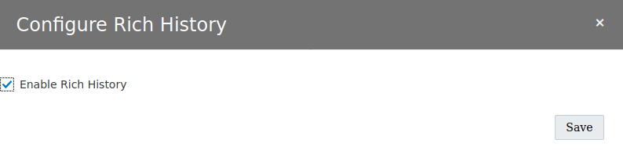

# Rich History

This feature of Oracle Blockchain Cloud Service is very nice. Data stored in the Blockchain are automatically stored in an Oracle Database (and so why not choose the best solution that is an Autonomous Database). In this case it is very easy to do complex requests on data stored in an Autonomous Database, knowing that Blockchain technology is very limited in terms of requests compared to Oracle Db.

First you need a Database. I used an Autonomous Transaction Database (ATP) but you can use what you want. This workshop will not explain how to create and work with ATP (look at other workshop on internet for that).

So my ATP (swingbench) is created and started. And I have already download the wallet that allow me to connect to the ATP with SQLDeveloper.

Open SQLDeveloper and connect to your ATP with your admin account (I do not explain that too).

You must create a user (obcsuser) with  SQLDeveloper

Now configure Rich History in the Dashboard of the founder (right upper click)

Enter the good configuration and click on Save

Now go to the channel  where your chaincode is deployed and click on Configure Rich History 

Then enable Rich History

Now all is ready and the only thing to do is to call your chaincode. Note that if you did the part 7 of this workshop (with the generator) then you just need to run the test again.

So after calling your chaincode you can now connect with SQLDeveloper to ATP with the user obcsuser.

You can see 3 tables :

- blockchain instance_channel name_state = the world state of the blockchain
- blockchain instance_channel name_hist = the history log of the blockchain
- blockchain instance_channel name_last = an internal table use by Oracle Blockchan CS in order to just push data that were not pushed before.

If you look at the state table you can see that the data coming from Oracle Blockchain CS are stored in a json format (so like it is stored in the Oracle Blockchain CS). 

The good news is that the JSON Type in Oracle Database is very powerfull so we can do some views easily in order to be able to do complex requests.

Launch SQL Worksheet with SQLDeveloper on the obcsuser and create a view. For ex if you did the Part 7 of the work shop you can do a view called Diploma.

Ex : you can copy and execute that statement in SQLDeveloper 

CREATE OR REPLACE VIEW v_diploma
as select d.*
from "myfounder_myfounderch2_state" state,
json_table(state.VALUEJSON, '$'
COLUMNS(
DocType VARCHAR2(30) PATH '$.DocType',
DiplomaID VARCHAR2(30) PATH '$.DiplomaID',
StudendID VARCHAR2(30) PATH '$.StudentID',
Name VARCHAR2(30) PATH '$.Name',
Year VARCHAR2(30) PATH '$.Year',
Mention VARCHAR2(30) PATH '$.Mention',
SchoolShort VARCHAR2(30) PATH '$.SchoolShort',
SchoolLong VARCHAR2(30) PATH '$.SchoolLong',
SchoolStreet VARCHAR2(30) PATH '$.SchoolStreet',
SchoolZip VARCHAR2(30) PATH '$.SchoolZip',
SchoolTown VARCHAR2(30) PATH '$.SchoolTown',
FileName VARCHAR2(30) PATH '$.FileName')) d
where DocType = 'Diploma'
and DiplomaId is not null
and DocType not like '%string%';

Then you can double click on the view V_Diploma and see the data concerning Diploma in the world state of the Blockchain.

Now you can use standard tools to query your data and do nice data analysis. For exemple you can use Oracle Data Visualization for Desktop (I will not detail that here, you can find many tuto on internet)

  

Next [Oracle Blockchain Platform Enterprise Edition](10-obpee.md)

