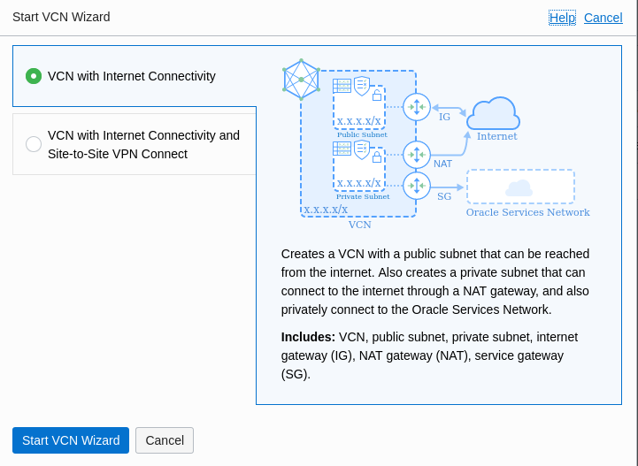
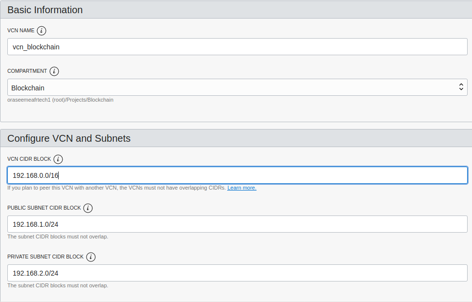
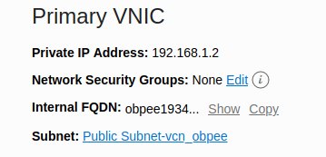

# Oracle Blockchain Platform Enterprise Edition (OBPEE)

OBPEE allows you to install Oracle Blockchain in your datacenters or on IaaS. You cannot create a Blockchain Cloud Service on free account on Oracle Cloud so the most easy way to test Oracle Blockchain on free account is to install OBPEE on Oracle IaaS. 

So the first step is to install OBPEE following the document did by Jens Lusebrink : JENS_OBPEE on OCI Guide_vx.xx (This document is not public for the moment but you can ask Oracle to get it easily).

For the version v.3.1 note some information :

- start : before beginning log on your account and create a compartment where you will create all the resources you need. In the menu on the left click on Identity / Compartments and create your compartment (ex : Blockchain)
- page 4 : when creating the VCN, do not choose the button 'Create VCN' but click on 'Start VCN Wizard'. In this case you will not have to do the step Create Subnet after Create VCN cause all will be done in one step.  And if you see in the document that you must create something that already exists then just do nothing cause the wizard has done it for you.

- page 9 : to go faster Oracle can give you directly the url of the OBP-Enterprise-Edition-disk001.vmdk on a public Object Storage. In this case you will not have to upload this file to the Object Storage. This will allow you to go directly to the create image step on page 12.

- page 13 : use a shape : VM.Standard2.2

- page 14 : you need to create iaas keys before creatin a serial console connection. Look there and create your keys : https://docs.cloud.oracle.com/en-us/iaas/Content/GSG/Tasks/creatingkeys.htm#

- page 14 : when you paste the url copied for the connection to the serial console you must add the keys you used with a -i ./your_private_key on 2 places (see below an exemple)

  ssh -i ./id_rsa -o ProxyCommand='ssh -i ./id_rsa -W %h:%p -p 443 ocid1.instanceconsoleconnection.oc1.eu-frankfurt-1.antheljsfrpx4mic2ejqb6pqxnuat4d3ffkabss57fl4pvl7bwds77x3ky2a@instance-console.eu-frankfurt-1.oraclecloud.com' ocid1.instance.oc1.eu-frankfurt-1.antheljsfrpx4micprethezhdd4rojk2q4jwyt2lh26nigv6ymj7vgggdc4q

- page 19 : Platform Host can be found clicking on the VM Iaas you created. This is the Internal FQDN.

  

Then follow now the step 2 Deploy the chaincode and adapt the tutorial to this context OBPEE.

The end...:o) 

